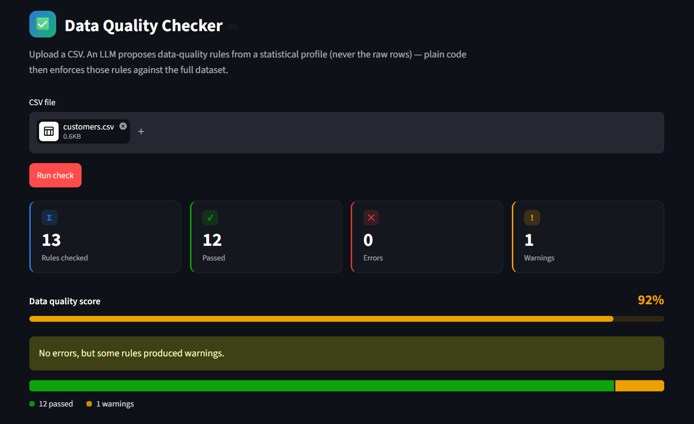

# LLM-Powered Data Quality Checker

Point it at a CSV and it profiles the data, asks an LLM to propose data-quality
rules, runs those rules deterministically, and prints a pass/fail report — from
the CLI or a Streamlit dashboard.

**Design principle: the LLM proposes checks, plain code enforces them.** The
model never sees raw rows — it hallucinates and doesn't scale — it only reasons
over a small statistical *profile* (types, null counts, min/max, sample values)
and returns declarative rules as JSON. Those rules are parsed, validated, and
run against the full dataset by an ordinary, deterministic engine. You get an
LLM's judgment about what *should* be true, with the reliability of plain code
doing the counting.

## Demo

| Dashboard | Rule results |
|---|---|
|  |  |

A full walkthrough is in [LLM-Data-Quality-Checker.mp4](LLM-Data-Quality-Checker.mp4).

### CLI output

```
$ python cli.py check data/customers.csv

Data Quality Report
============================================================
8 rules | 2 passed | 5 errors | 1 warnings
[PASS] customer_id_not_null   (not_null on customer_id)      -> 0 violating rows
[FAIL] customer_id_unique     (unique on customer_id)        -> 1 violating rows
[FAIL] email_format           (regex on email)               -> 1 violating rows
[FAIL] age_range               (range on age)                  -> 2 violating rows
[FAIL] country_allowed        (allowed_values on country)    -> 3 violating rows
[FAIL] amount_non_negative    (range on amount_spent)        -> 2 violating rows
...
```

The bundled sample data ([data/customers.csv](data/customers.csv)) is deliberately
messy — a duplicate id, a malformed email, ages of `-5` and `999`, a
`US` / `USA` / `United States` mix, and a negative spend — so the checks have
something to catch. [data/example_llm_rules.json](data/example_llm_rules.json)
shows a realistic set of rules an LLM proposes for that file.

## How it works

```
 CSV ─► src/profile.py ─► {per-column stats}
                                │
                                ▼
                       src/llm_rules.py ─► LLM ─► rules as JSON ─► validate
                                │
 CSV ──────────────► src/rules.py (engine) ◄───────┘
                                │
                                ▼
                       src/report.py ─► pass/fail report + summary
                                │
                    ┌───────────┴───────────┐
                    ▼                       ▼
                 cli.py                  app.py
             (terminal report)      (Streamlit dashboard)
```

1. **Profile** — read the CSV as strings (so blanks and messiness stay
   visible) and compute per-column stats: inferred type, blank/distinct
   counts, min/max/mean for numeric columns, and a sample of values.
2. **Propose** — send that compact profile (never the raw rows) to an LLM,
   which returns a JSON array of candidate rules. Each rule is parsed into a
   typed `Rule` object and validated; anything malformed or referencing a
   column that doesn't exist is dropped rather than trusted.
3. **Enforce** — a deterministic engine runs each surviving rule against the
   *full* DataFrame and counts violations, with a handful of sample offending
   rows kept for the report.
4. **Report** — results are formatted into a plain-text pass/fail report and a
   numeric summary, both consumed by the CLI and the Streamlit UI.

## Project structure

```
llm-data-quality-checker/
├── cli.py                    # CLI entry point: `python cli.py check <csv>`
├── app.py                    # Streamlit dashboard entry point
├── src/
│   ├── config.py              # Env/.env-driven settings (LLM provider, model, sample size)
│   ├── profile.py              # CSV -> per-column statistical profile
│   ├── llm_rules.py           # Sends the profile to an LLM, parses/validates rules; baseline_rules() heuristic fallback
│   ├── rules.py                # Rule schema + the deterministic check engine
│   ├── report.py               # Runs rules, formats the text report, builds the summary dict
│   └── runner.py               # check(): orchestrates load -> profile -> propose -> run -> report
├── tests/
│   └── test_rules.py           # Engine tests for every check type (no network / no LLM required)
├── data/
│   ├── customers.csv           # Deliberately messy sample dataset
│   └── example_llm_rules.json  # Example LLM-proposed ruleset for customers.csv
├── Screenshots/                # Dashboard screenshots used in this README
├── LLM-Data-Quality-Checker.mp4 # Recorded demo walkthrough
├── requirements.txt
├── .env.example
└── LICENSE
```

### File-by-file

| File | Responsibility |
|---|---|
| [cli.py](cli.py) | Thin CLI wrapper around `runner.check()`. Prints the text report and summary, exits nonzero on `error`-severity failures. |
| [app.py](app.py) | Streamlit UI: upload/select a CSV, toggle LLM vs. heuristic rules, render KPI tiles, a quality-score meter, a pass/fail breakdown, and a filterable rule-results table. Pure presentation — no rule logic lives here. |
| [src/config.py](src/config.py) | Loads `.env`, exposes `LLM_PROVIDER`, model names, and how many sample values per column are shown to the LLM. |
| [src/profile.py](src/profile.py) | Reads the CSV as strings and builds the per-column profile (type inference, blank/distinct counts, numeric min/max/mean, sample or full distinct values for low-cardinality columns). This profile — not the raw rows — is what the LLM sees. |
| [src/llm_rules.py](src/llm_rules.py) | `propose_rules()` sends the profile to Anthropic or OpenAI per the system prompt, parses the returned JSON into `Rule` objects, and drops anything invalid. `baseline_rules()` generates a simpler heuristic ruleset with no API call, used for `--no-llm` and in tests. |
| [src/rules.py](src/rules.py) | Defines the `Rule` and `RuleResult` dataclasses and `run_rule()`, the engine that evaluates one rule against a DataFrame. This is the single place check logic lives. |
| [src/report.py](src/report.py) | `run_rules()` executes a rule list; `format_report()` renders the human-readable report; `summary()` returns pass/error/warning counts. |
| [src/runner.py](src/runner.py) | `check(path, use_llm)` ties the whole pipeline together as a plain function — load, profile, propose or fall back to heuristic rules, run, report. Framework-free by design so it can be dropped into cron, Airflow, or a CI step. |
| [tests/test_rules.py](tests/test_rules.py) | Unit tests for every check type (`not_null`, `unique`, `range`, `allowed_values`, `regex`, `row_count_min`) against a small fixture — no network access needed. |

## Supported checks

| Check | Params | Fails when |
|---|---|---|
| `not_null` | — | value is blank |
| `unique` | — | value is a duplicate of an earlier non-blank value |
| `range` | `min`, `max` | value is unparseable as a number, or outside the bounds |
| `allowed_values` | `values` | value isn't in the given set |
| `regex` | `pattern` | value doesn't fully match the pattern |
| `row_count_min` | `min` | the dataset has fewer than `min` rows (table-level, no column) |

## Setup

```bash
python -m venv .venv && source .venv/bin/activate   # Windows: .venv\Scripts\activate
pip install -r requirements.txt
cp .env.example .env      # add an API key for LLM-proposed rules (optional)
```

### Configuration (`.env`)

| Variable | Default | Purpose |
|---|---|---|
| `LLM_PROVIDER` | `none` | `anthropic`, `openai`, or `none` |
| `ANTHROPIC_API_KEY` | — | required when `LLM_PROVIDER=anthropic` |
| `OPENAI_API_KEY` | — | required when `LLM_PROVIDER=openai` |
| `ANTHROPIC_MODEL` | `claude-sonnet-4-6` | model used for rule proposal |
| `OPENAI_MODEL` | `gpt-4o-mini` | model used for rule proposal |

No key is required to use the tool — `--no-llm` (CLI) or leaving the "Use LLM"
toggle off (dashboard) runs the heuristic `baseline_rules()` instead.

## Usage

### CLI

```bash
python cli.py check data/customers.csv          # LLM proposes the rules
python cli.py check data/customers.csv --no-llm  # heuristic rules, no API key needed
```

Exit code is `0` when there are no error-severity failures and nonzero
otherwise, so it drops straight into CI or a pipeline gate.

### Dashboard

```bash
streamlit run app.py
```

Upload a CSV (or use the bundled sample), optionally toggle LLM-proposed
rules, and run the check. The dashboard shows a KPI row, a data-quality
score meter, a pass/warn/error breakdown, and a filterable rule-results table
alongside the raw report and column profile.

## Testing

```bash
pytest
```

`tests/test_rules.py` exercises the deterministic engine directly — no
network access or API key required.

## Extending

Add a new check in one place: implement the branch in
`rules.run_rule()`, add its name to `CHECKS` in [src/rules.py](src/rules.py),
and describe it in the system prompt in [src/llm_rules.py](src/llm_rules.py)
so the LLM knows it can propose it.

## Stack

Python · pandas · Streamlit · Anthropic / OpenAI SDKs

## License

[MIT](LICENSE) © Aymen Baig
